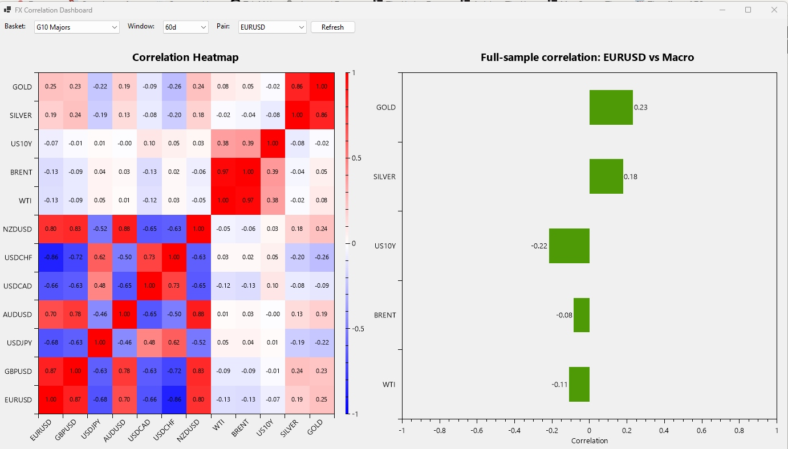

# FX Correlation Dashboard



A Windows Forms application that visualises rolling and full-sample correlations between G10 FX pairs and macro factors (WTI, Brent, US10Y, Silver, Gold). Displayed image is of Monday, 23rd of March 2026.

## Features

- **Correlation Heatmap** — colour-coded matrix of rolling correlations across all instruments
- **Full-sample Bar Chart** — select any FX pair to see its correlation against macro factors
- **Basket Selection** — G10 Majors, JPY Crosses, Commodity FX
- **Rolling Window** — 30d, 60d, 90d, 120d, 252d
- **Auto-seeding** — downloads 3 years of daily data from Yahoo Finance on first run

## Tech Stack

- .NET 8 / Windows Forms
- OxyPlot for charting
- SQL Server LocalDB for data storage
- Yahoo Finance API for market data

## Setup

```bash
cd App
dotnet restore
dotnet build
dotnet run
```

The app creates the database tables and seeds them with real market data automatically on first launch.

## Project Structure

```
App/
├── Program.cs              # Entry point + DB seeding
├── MainForm.cs             # UI: heatmap, bar chart, controls
├── SeedData.cs             # Yahoo Finance data downloader
├── Data/
│   ├── FxDataRepository.cs # SQL Server data access
│   └── Model.cs            # PriceSeries, CorrelationResult records
└── Engine/
    ├── CorrelationEngine.cs # Pearson correlation, rolling + full-sample
    └── ReturnCalculator.cs  # Log return computation
```
